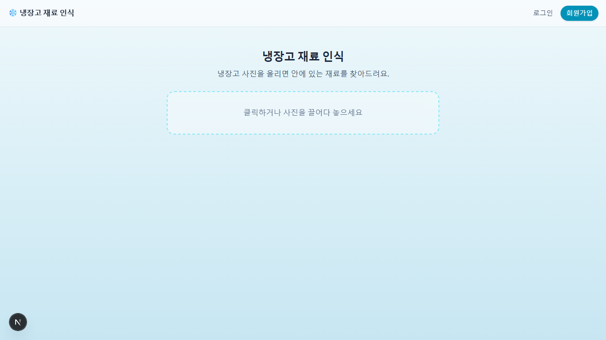
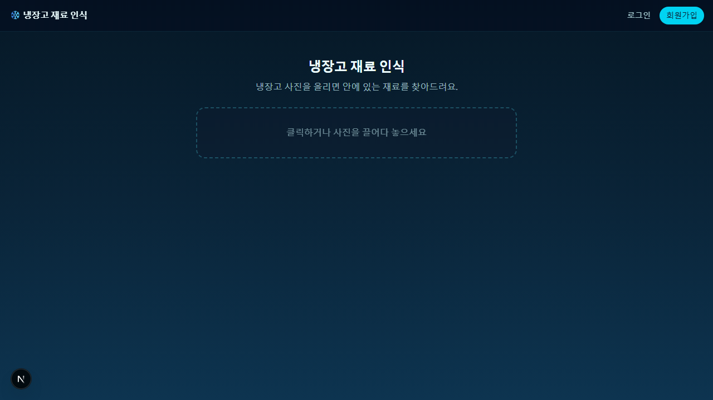
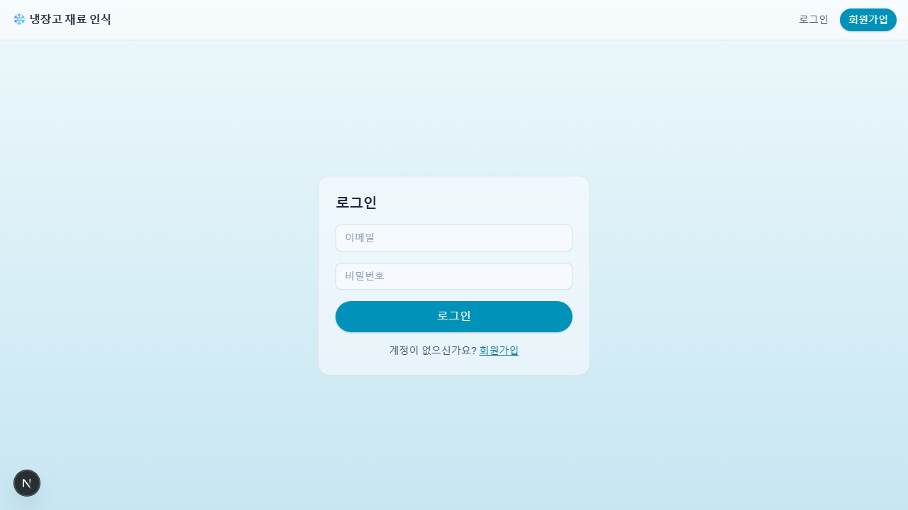
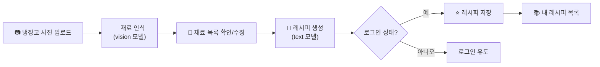

# ❄️ 냉장고 재료 인식 & 레시피 추천

냉장고 사진을 올리면 AI가 재료를 인식하고, 그 재료로 만들 수 있는 레시피를 추천해주는 웹 앱입니다.
마음에 드는 레시피는 계정에 저장해 나중에 다시 볼 수 있습니다.

[](https://nextjs.org)
[](https://www.typescriptlang.org)
[](https://tailwindcss.com)
[](https://www.prisma.io)
[](https://www.sqlite.org)

## 미리보기

| 라이트 모드 | 다크 모드 |
|---|---|
|  |  |

<details>
<summary>로그인 화면 보기</summary>



</details>

## ✨ 기능

세 단계로 나눠 만들었고, 각 단계의 상세 요구사항은 PRD 문서에 정리되어 있습니다.



1. **재료 인식** — 냉장고 사진을 업로드하면 OpenRouter의 `google/gemma-4-26b-a4b-it:free` 모델(비전)이
   보이는 식재료를 목록으로 뽑아줍니다. 인식 결과는 직접 추가/삭제해서 고칠 수 있습니다.
   → [PRD_step1.md](PRD_step1.md)
2. **레시피 생성** — 확정된 재료 목록으로 같은 모델(텍스트)을 호출해 조리 가능한 레시피 후보를
   생성합니다. 요리명, 부족한 재료, 조리 순서, 예상 조리 시간, 난이도를 함께 보여줍니다.
   → [PRD_step2.md](PRD_step2.md)
3. **계정 & 레시피 저장** — 이메일/비밀번호로 회원가입한 뒤, 마음에 드는 레시피를 저장하고
   "내 레시피"에서 다시 확인하거나 삭제할 수 있습니다.
   → [PRD_step3.md](PRD_step3.md)

## 🛠 기술 스택

| 영역 | 사용 기술 |
|---|---|
| 프레임워크 | Next.js 16 (App Router, TypeScript) |
| 스타일 | Tailwind CSS v4 |
| DB | SQLite (Prisma 7 + `@libsql/client` 드라이버 어댑터) |
| 인증 | 자체 구현 이메일/비밀번호 (bcrypt 해시 + DB 세션 쿠키) |
| AI | [OpenRouter](https://openrouter.ai) API, `google/gemma-4-26b-a4b-it:free` 모델 |

## 🚀 시작하기

```bash
npm install
cp .env.example .env   # OPENROUTER_API_KEY를 실제 키로 채워주세요
npx prisma migrate dev # 로컬 SQLite DB 생성
npm run dev
```

[http://localhost:3000](http://localhost:3000) 에서 확인할 수 있습니다.

### 🔑 환경 변수 (`.env`)

| 변수 | 설명 |
|---|---|
| `OPENROUTER_API_KEY` | [OpenRouter](https://openrouter.ai)에서 발급받은 API 키 |
| `DATABASE_URL` | SQLite 파일 경로. 기본값 `file:./prisma/dev.db` |

## 📋 주요 명령어

| 명령어 | 설명 |
|---|---|
| `npm run dev` | 개발 서버 실행 |
| `npm run build` | 프로덕션 빌드 |
| `npm run start` | 프로덕션 빌드 실행 |
| `npm run lint` | ESLint 검사 |
| `npx prisma migrate dev --name <설명>` | 스키마 변경 후 마이그레이션 생성/적용 |
| `npx prisma studio` | 로컬 DB 데이터 확인 |

## 📁 프로젝트 구조

```
src/app/
├─ page.tsx                     # 홈: 사진 업로드 → 재료 인식 → 레시피 추천 → 저장
├─ login/, signup/               # 로그인 / 회원가입
├─ recipes/                      # 내가 저장한 레시피
└─ api/
   ├─ recognize-ingredients/     # 이미지 → 재료 인식 (OpenRouter, vision)
   ├─ generate-recipes/          # 재료 → 레시피 생성 (OpenRouter, text)
   ├─ recipes/                   # 레시피 저장/조회/삭제
   └─ auth/                      # 회원가입/로그인/로그아웃/세션 확인

src/lib/
├─ db.ts                         # Prisma 클라이언트 싱글턴
└─ auth.ts                       # 비밀번호 해시, 세션 쿠키 관리

prisma/schema.prisma              # User / Session / SavedRecipe 스키마
```

더 자세한 아키텍처와 개발 시 주의사항은 [CLAUDE.md](CLAUDE.md)를 참고하세요.
